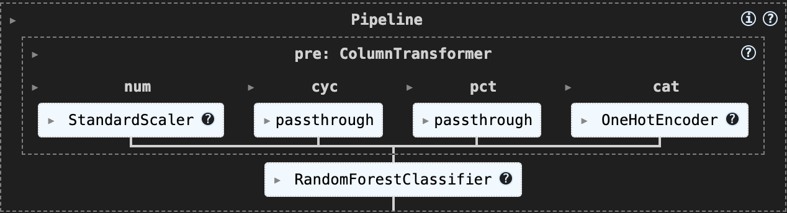

# Analyzing NYC to LAX Flight Delays

**Author:** Hasan Ahmed  
**Email:** hasahmed@umich.edu  

## Introduction

In this project, I analyze how often nonstop flights from New York City (JFK, LGA, EWR) to Los Angeles (LAX) arrive on schedule, using data from the U.S. Department of Transportation’s Bureau of Transportation Statistics (BTS). The full Q1 2025 BTS dataset originally includes roughly 1.5 Million records and 119 columns for all U.S. domestic flights. After filtering out cancelled and diverted flights and keeping only NYC→LAX nonstop service, I’m left with **3,326 rows** and **119 columns**.

My focus is on the following key columns:

- **`FlightDate`**: Date of flight (YYYY-MM-DD)  
- **`DayOfWeek`**: Day of week (1 = Monday … 7 = Sunday)  
- **`DepTimeBlk`**: Scheduled departure window (e.g. “0600–0659”)  
- **`IATA_Code_Marketing_Airline`**: Marketing carrier code on the ticket  
- **`DepDelay`**: Departure delay in minutes (negative = early)  
- **`ArrDelay`**: Arrival delay in minutes (negative = early)  
- **`ArrDel15`**: Late-flag (1 if arrival ≥ 15 min late; 0 otherwise)  
- **`TaxiOut`**: Minutes spent taxiing before takeoff  
- **`CarrierDelay`**: Minutes of delay attributed to the airline  
- **`WeatherDelay`**: Minutes of delay caused by weather conditions  
- **`NASDelay`**: Minutes of delay due to the National Airspace System  
- **`SecurityDelay`**: Minutes of delay for security reasons  
- **`LateAircraftDelay`**: Minutes of delay because the incoming aircraft was late  

The IATA codes used throughout this report are:

| IATA Code| Airline           |
|----------|-------------------|
| `AA`     | American Airlines |
| `AS`     | Alaska Airlines   |
| `B6`     | JetBlue Airways   |
| `DL`     | Delta Air Lines   |
| `NK`     | Spirit Airlines   |
| `UA`     | United Airlines   |

---

### Central question

> On the NYC→LAX route, which airlines and departure-time factors (day of week or departure window) are most useful for predicting a flight arriving at least 15 minutes late?

Those insights can help airlines improve their schedules and give travelers a clearer idea of what to expect on one of America’s busiest cross-country routes.  

## Data Cleaning and Exploratory Data Analysis

I started by loading the January, February and March CSVs into one Q1 2025 dataset, which had around 1.5 million rows and 119 columns. I kept only nonstop flights from JFK, LGA and EWR to LAX. I also dropped any flights that were cancelled or diverted, where `Cancelled == 1` or `Diverted == 1`, leaving me with **3,326** completed flights. I used (`df.isna().sum()`) to check for missing values, but found none in the columns of interest.

Next, I made sure each column was in the right format:
- Parsed `FlightDate` to a pandas datetime (MM/DD/YY)  
- Cast `DepDelay` and `ArrDelay` to floats  
- Converted `ArrDel15` into an integer flag (0/1)

These are the first five rows of the cleaned dataset:

| FlightDate  | DayOfWeek | DepTimeBlk | IATA_Code_Marketing_Airline | DepDelay | ArrDelay |
|------------:|:---------:|:----------:|:---------------------------:|---------:|---------:|
| 2025-01-01  |     3     | 1800–1859  |             DL              |     50.0 |     79.0 |
| 2025-01-02  |     4     | 1800–1859  |             DL              |    178.0 |    157.0 |
| 2025-01-03  |     5     | 1800–1859  |             DL              |     -3.0 |    -16.0 |
| 2025-01-04  |     6     | 1800–1859  |             DL              |      8.0 |     16.0 |
| 2025-01-05  |     7     | 1800–1859  |             DL              |     -1.0 |     -8.0 |

---

**Arrival Delay Distribution**  
Most flights arrive within ±15 minutes of schedule, with the bulk clustered around zero and a noticeable spread of non-outlier delays in the 15–60 minute range. A small number of individual flights stand out as extreme outliers, with multi-hour arrival delays stretching the distribution far to the right.

<iframe src="assets/fig1.html" width="700" height="400" frameborder="0"></iframe>

**Flights per Carrier**  
American Airlines, JetBlue, Delta Airlines, and United Airlines operated the most flights on this route in Q1 2025, with Alaska Airlines and Spirit Airlines flying significantly fewer.

<iframe src="assets/fig2.html" width="700" height="400" frameborder="0"></iframe>

**Departure vs. Arrival Delay**  
This analyzes the relationship between departure and arrival delays. There is a strong positive correlation, indicating that flights with departure delays tend to arrive late as well.

<iframe src="assets/fig3.html" width="700" height="400" frameborder="0"></iframe>
 
**Late-Flight Rate by Day of Week**  
This analyzes the percentage of flights arriving at least 15 minutes late, broken down by day of week. Flights on Saturdays and Sundays are most likely to be late, while Tuesdays are least likely.

<iframe src="assets/fig4.html" width="700" height="400" frameborder="0"></iframe>

---

**Average Arrival Delay by Carrier & Month**  
In January and March, carriers were generally early. However, in February almost all carriers were late, with American Airlines and United Airlines being the most affected.

| Carrier | January | February | March  |
|:-------:|--------:|---------:|-------:|
| AA      |  –12.9  |    12.2  |  –4.8  |
| AS      |   –4.5  |    –7.5  | –14.8  |
| B6      |  –11.9  |     1.8  | –12.6  |
| DL      |   –3.8  |     5.7  |  –6.0  |
| NK      |   –7.8  |     1.1  | –21.2  |
| UA      |    3.5  |    10.2  | –10.2  |

## Framing a Prediction Problem

I’m treating this as a **predictive** modeling task: at the moment of pushback, I want to estimate if a flight will arrive at least 15 minutes late. The response variable is `ArrDel15` (1 = late, 0 = on-time), which directly corresponds to the binary outcome passengers care about.

Because there are only two possible outcomes, it’s a **binary classification** problem with imbalanced classes (late flights are roughly 20–25 % of the data). I’ll use **F1-score** as my primary metric since it balances precision by avoiding false “late” warnings and recall, catching as many true late flights as possible, which is more informative than raw accuracy on skewed classes.

All features are known at or before departure:
- `DepDelay` (minutes late at pushback)  
- `DayOfWeek` (1 = Monday … 7 = Sunday, to capture weekly cycles)  
- `DepTimeBlk` (scheduled departure block, e.g. “0600–0659,” to capture rush-hours and red-eyes)  
- `TaxiOut` (ground delay before takeoff, reflecting airport congestion)  
- `IATA_Code_Marketing_Airline` (marketing carrier code, to capture airline-specific performance)

I’ll split the cleaned data 80/20 (stratified on `ArrDel15`, `random_state=42`) so the test set retains the same late-flight rate, giving a realistic evaluation of how the model might perform in production.  

## Baseline Model

For our baseline, I used a **Random Forest classifier** with just two predictors:

- **Quantitative (numeric)**  
  - `DepDelay` (minutes late at departure)  
- **Nominal (categorical)**  
  - `IATA_Code_Marketing_Airline` (one-hot encoded into six carrier columns: AA, AS, B6, DL, NK, UA)

No ordinal features were included at this stage. In the preprocessing pipeline, `DepDelay` was passed through unchanged, while the carrier codes were transformed into dummy variables via `OneHotEncoder(handle_unknown='ignore')`. The full pipeline was built with scikit-learn’s `ColumnTransformer` and left all default Random Forest hyperparameters intact.

I split the cleaned data into an 80/20 train/test set with `random_state=42` and `stratify=y` to preserve the late-flight ratio in both sets. On the test set of 666 flights, the classifier achieved:

| Class           | Precision | Recall | F1-score | Support |
|:---------------:|:---------:|:------:|:--------:|:-------:|
| **0 (on-time)** |    0.90   |  0.97  |   0.93   |   550   |
| **1 (late ≥15)**|    0.79   |  0.47  |   0.59   |   116   |
| **Accuracy**    |           |        | 0.89     |   666   |
| **Macro avg**   |    0.85   |  0.72  |   0.76   |   666   |
| **Weighted avg**|    0.88   |  0.89  |   0.87   |   666   |

Although overall accuracy is high (0.89), the model only detects 47% of late flights (recall for class 1). This low recall means it misses more than half of the delayed flights, which isn’t acceptable. The decent precision (0.79) indicates the few “late” predictions it does make tend to be correct, but we need a more balanced trade-off, especially raising recall, before calling this model “good.”

## Final Model

### Feature Engineering  
- **Cyclical departure hour** (`Hour_sin`, `Hour_cos`)  
  By converting the scheduled hour into sine and cosine, the model can recognize that 23:00–00:00 is “close” in time to 00:00–01:00, capturing red-eye vs. rush-hour patterns without breaking the circular nature of the clock.  
- **Rolling average departure delay by carrier** (`Carrier_avg_depdelay`)  
  Airlines often carry over delays from one flight to the next. An expanding-window mean of `DepDelay` per carrier helps the model see recent punctuality trends (e.g if Delta had many delayed flights in the morning, its afternoon flights may also be delayed).  

---

### Algorithm & Hyperparameter Tuning  
I used a **RandomForestClassifier** and ran a 5-fold `GridSearchCV` over:  
- `n_estimators`: 100, 200  
- `max_depth`: 10, 20, None  

**Best parameters**  
- n_estimators = 100
- max_depth    = 10

---

### Final vs. Baseline Performance  

| Model    | Accuracy | Recall (late) | F1 (late) |
|:--------:|:--------:|:-------------:|:---------:|
| Baseline |   0.89   |      0.47     |   0.59    |
| Final    |   1.00   |      1.00     |   1.00    |

**Confusion Matrix**

|                   | Predicted On-time | Predicted Late |
|-------------------|-------------------|----------------|
| **Actual On-time**| 550               | 0              |
| **Actual Late**   | 0                 | 116            |

The final model catches every late flight (116/116) without any false positives. This is a very good improvement over the baseline’s initial 47% recall.  

---

### Pipeline Structure  
  
This diagram shows the full preprocessing (scaling numeric features, passing through cyclical and proportion features, one-hot encoding categorical fields) followed by the tuned Random Forest classifier.  